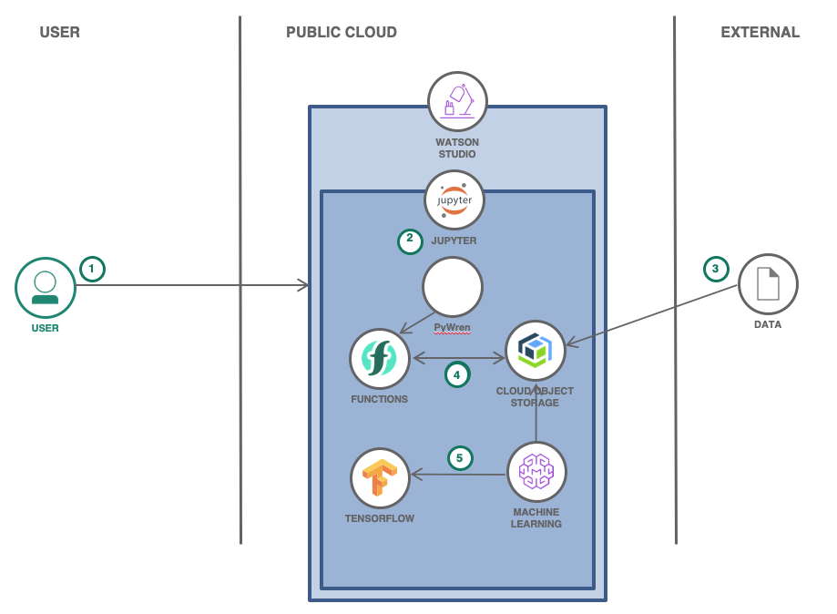
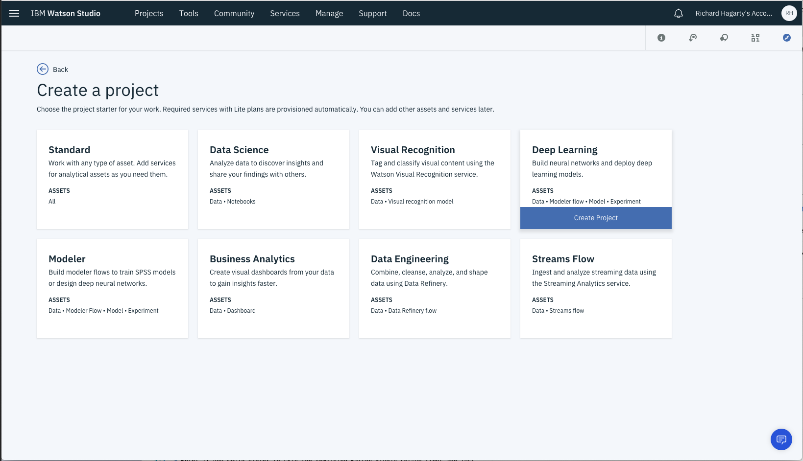
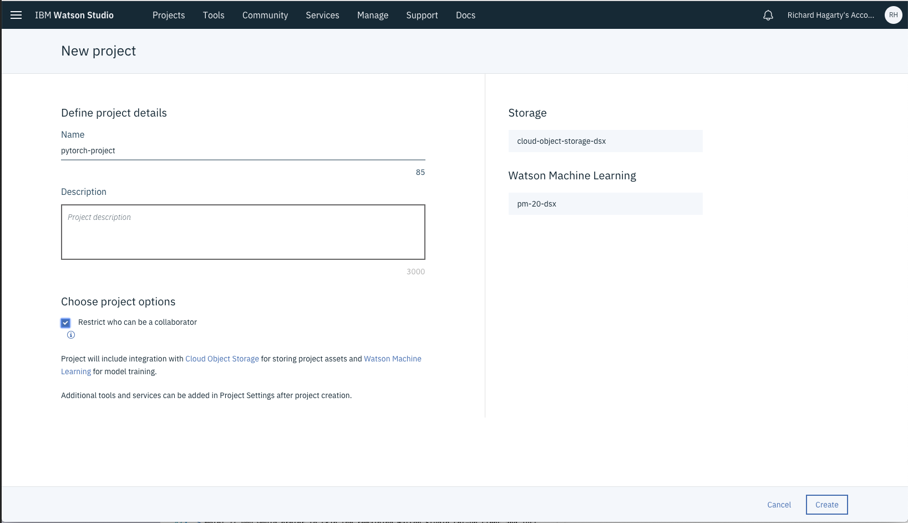
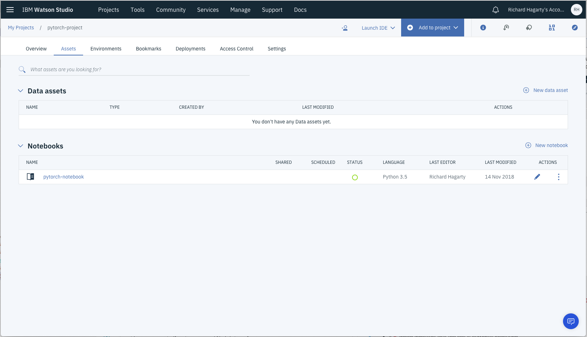

!! WORK IN PROGRESS !!

# Speed up data pre-processing with PyWren in Deep Learning

Let’s say you write a function in Python to process and analyze some data. You successfully test the function using a small amount of data and now you want to run the function as a serverless action at massive scale, with parallelism, against terabytes of data.

What options do you have? Obviously, you don’t want to learn cloud IT tricks and setup VMs, for example. Nor do you necessarily want to become a serverless computing expert in scaling data inputs, processing outputs, and monitoring concurrent executions.

PyWren provides such a solution - it allows you to run your code against a large data set, get the results, and consider the value of insights gained. It greatly reduces the processing time by parallelization of the jobs in a simple manner.

In this code pattern, we will guide the user through an end-to-end workflow that covers data pre-processing with PyWren, then using the data to train AI models.

## What is PyWren

[PyWren](http://pywren.io/) is an open source project that executes user’s Python code and its dependencies as serverless actions on a serverless platform.  Without requiring knowledge of how serverless actions are invoked and run, PyWren executes them at massive scale and then monitors the results.

PyWren includes a client that runs locally and a runtime that deploys in the cloud as a serverless action. PyWren uses object storage to pass information between client and server sides. On the client side, PyWren takes the Python code and relevant data, serializes them, and puts them into object storage. The client invokes the stored actions to run in parallel and then waits for the results. On the server side, for each function, PyWren takes the code and processes the relevant data from object storage, storing the results.

## PyWren and IBM Cloud

[PyWren-IBM-Cloud](https://github.com/pywren/pywren-ibm-cloud) is a extension of PyWren that has been adapted for IBM Cloud Functions and IBM Cloud Oject Storage.

## Facial recognition

In this code pattern we will use a Jupyter Notebook running in Watson Studio to demonstrate how serverless computing can provide a great benefit for AI data preprocessing. We demonstrate Face Recognition deep learning over Watson Machine Learning service, while letting PyWren with IBM Cloud Functions do the data preparation phase. As we will show this makes an entire process up to 50 times faster compared to running the same code without leveraging serverless computing.

Our notebook is based on the blog [Building a Facial Recognition Pipeline with Deep Learning in Tensorflow](https://hackernoon.com/building-a-facial-recognition-pipeline-with-deep-learning-in-tensorflow-66e7645015b8), written by Cole Murray.

The notebook introduces commands for getting data, training_definition persistance to Watson Machine Learning repository, model training, deployment and scoring.

When you have completed this code pattern, you will learn:

* How to work with Watson Machine Learning experiments to train Deep Learning models (Tensorflow)
* How to save trained models in the Watson Machine Learning repository
* How to deploy a trained model online and score
* How IBM Cloud Functions can be used for data preparation phase
* The value of PyWren for IBM Cloud



## Flow

1. PyWren client stores code and data to object storage
1. PyWren client invokes stored actions to run in parellel using IBM Cloud Functions
1. PyWren server-side runtime processes the data from object storaage
1. PyWren server-side runtime monitors the execution of the functions and returns results back to object storage
1. PwWren client retrieves results from object storage

# Watch the Video

COMING!!!

# Steps

1. [Sign up for Watson Studio](#1-sign-up-for-watson-studio)
1. [Create a new project](#2-create-a-new-project)
1. [Create the notebook](#3-create-the-notebook)
1. [Create a Watson Machine Learning Service instance](#4-create-a-watson-machine-learning-service-instance)
1. [Create an IBM Cloud Object Storage Service instance](#5-create-an-ibm-cloud-object-storage-service-instance)
1. [Create an IBM Cloud Functions account](#6-create-an-ibm-cloud-functions-account)
1. [Run the notebook](#7-run-the-notebook)
1. [See the results](#8-see-the-results)

### 1. Sign up for Watson Studio

Sign up for IBM's [Watson Studio](https://dataplatform.cloud.ibm.com/). By creating a project in Watson Studio a free tier Object Storage service will be created in your IBM Cloud account. Take note of your service names as you will need to select them in the following steps.

Note: When creating your Object Storage service, select the `Free storage` type in order to avoid having to pay an upgrade fee.

### 2. Create a new project

From the Watson Studio home page, select `New Project`, then select the `Create Project` button located in the `Data Science` tile.



* To create a project in Watson Studio, give the project a name and either create a new Cloud Object Storage service or select an existing one from your IBM Cloud account.



* Upon a successful project creation, you are taken to a dashboard view of your project. Take note of the `Assets` and `Settings` tabs, we'll be using them to associate our project with any external assets (such as notebooks) and any IBM Cloud services.


### 3. Create the notebook

From the project dashboard view, select the `Add to project` drop-down menu and click on `Notebook`.


Use the `From URL` tab to create our notebook.

* Give your notebook a name and select your desired runtime. In this case, select the `Default Python 3.5 Free` option.

* For URL, enter the following URL for the notebook stored in our GitHub repository:

  ```bash
  https://raw.githubusercontent.com/IBM/data-pre-processing-with-pywren/master/notebooks/facial-recognition.ipynb
  ```


* Press the `Create Notebook` button.

### 4. Create a Watson Machine Learning Service instance

### 5. Create an IBM Cloud Object Storage Service instance

### 6. Create an IBM Cloud Functions account

### 7. Run the notebook

To view your notebooks, select `Notebooks` in the project `Assets` list. To run a notebook, simply click on the `edit` icon listed in the row associated with the notebook in the `Notebooks` list.



Some background on executing notebooks:

> When a notebook is executed, what is actually happening is that each code cell in
the notebook is executed, in order, from top to bottom.
>
> Each code cell is selectable and is preceded by a tag in the left margin. The tag
format is `In [x]:`. Depending on the state of the notebook, the `x` can be:
>
>* A blank, this indicates that the cell has never been executed.
>* A number, this number represents the relative order this code step was executed.
>* A `*`, which indicates that the cell is currently executing.
>
>There are several ways to execute the code cells in your notebook:
>
>* One cell at a time.
>   * Select the cell, and then press the `Play` button in the toolbar.
>* Batch mode, in sequential order.
>   * From the `Cell` menu bar, there are several options available. For example, you
    can `Run All` cells in your notebook, or you can `Run All Below`, that will
    start executing from the first cell under the currently selected cell, and then
    continue executing all cells that follow.
>* At a scheduled time.
>   * Press the `Schedule` button located in the top right section of your notebook
    panel. Here you can schedule your notebook to be executed once at some future
    time, or repeatedly at your specified interval.

# Sample output

## License

This code pattern is licensed under the Apache License, Version 2. Separate third-party code objects invoked within this code pattern are licensed by their respective providers pursuant to their own separate licenses. Contributions are subject to the [Developer Certificate of Origin, Version 1.1](https://developercertificate.org/) and the [Apache License, Version 2](https://www.apache.org/licenses/LICENSE-2.0.txt).

[Apache License FAQ](https://www.apache.org/foundation/license-faq.html#WhatDoesItMEAN)