# Speed up data pre-processing with PyWren in Deep Learning

Let’s say you write a function in Python to process and analyze some data. You successfully test the function using a small amount of data and now you want to run the function as a serverless action at massive scale, with parallelism, against terabytes of data.

What options do you have? Obviously, you don’t want to learn cloud IT tricks and setup VMs, for example. Nor do you necessarily want to become a serverless computing expert in scaling data inputs, processing outputs, and monitoring concurrent executions.

PyWren provides such a solution - it allows you to run your code against a large data set, get the results, and consider the value of insights gained. It greatly reduces the processing time by parallelization of the jobs in a simple manner.

In this code pattern, we will guide the user through an end-to-end workflow that covers data pre-processing with PyWren, then using the data to train AI models.

## What is PyWren

[PyWren](http://pywren.io/) is an open source project that executes user’s Python code and its dependencies as serverless actions on a serverless platform.  Without requiring knowledge of how serverless actions are invoked and run, PyWren executes them at massive scale and then monitors the results.

PyWren includes a client that runs locally and a runtime that deploys in the cloud as a serverless action. PyWren uses object storage to pass information between client and server sides. On the client side, PyWren takes the Python code and relevant data, serializes them, and puts them into object storage. The client invokes the stored actions to run in parallel and then waits for the results. On the server side, for each function, PyWren takes the code and processes the relevant data from object storage, storing the results.

## PyWren and IBM Cloud

[PyWren-IBM-Cloud](https://github.com/pywren/pywren-ibm-cloud) is a extension of PyWren that has been adapted for IBM Cloud Functions and IBM Cloud Oject Storage.

## Facial recognition

In this code pattern we will use a Jupyter Notebook running in Watson Studio to demonstrate how serverless computing can provide a great benefit for AI data preprocessing. We demonstrate Face Recognition deep learning over Watson Machine Learning service, while letting PyWren with IBM Cloud Functions do the data preparation phase. As we will show this makes an entire process up to 50 times faster compared to running the same code without leveraging serverless computing.

Our notebook is based on the blog [Building a Facial Recognition Pipeline with Deep Learning in Tensorflow](https://hackernoon.com/building-a-facial-recognition-pipeline-with-deep-learning-in-tensorflow-66e7645015b8), written by Cole Murray.

The notebook introduces commands for getting data, training_definition persistance to Watson Machine Learning repository, model training, deployment and scoring.

When you have completed this code pattern, you will learn:

* How to work with Watson Machine Learning experiments to train Deep Learning models (Tensorflow)
* How to save trained models in the Watson Machine Learning repository
* How to deploy a trained model online and score
* How IBM Cloud Functions can be used for data preparation phase
* The value of PyWren for IBM Cloud


## Flow

1. PyWren client stores code and data to object storage
1. PyWren client invokes stored actions to run in parallel using IBM Cloud Functions
1. PyWren server-side runtime processes the data from object storaage
1. PyWren server-side runtime monitors the execution of the functions and returns results back to object storage
1. PwWren client retrieves results from object storage

## Included components

* [Watson Machine Learning](https://cloud.ibm.com/catalog/services/machine-learning): Make smarter decisions, solve tough problems, and improve user outcomes.
* [Watson Studio](https://developer.ibm.com/components/watson-studio-c/): IBM's integrated hybrid environment that provides flexible data science tools to build and train AI models and prepare and analyze data.
* [Jupyter Notebooks](https://jupyter.org/): An open-source web application that allows you to create and share documents that contain live code, equations, visualizations and explanatory text.
* [Cloud Object Storage](https://cloud.ibm.com/catalog/services/cloud-object-storage): Provides flexible, cost-effective, and scalable cloud storage for unstructured data.

## Featured technologies

* [Artificial Intelligence](https://medium.com/ibm-data-science-experience): Artificial intelligence can be applied to disparate solution spaces to deliver disruptive technologies.
* [Python](https://www.python.org/): Python is a programming language that lets you work more quickly and integrate your systems more effectively.
* [PyWren](http://pywren.io/): PyWren is an open source project that executes user’s Python code and its dependencies as serverless actions on a serverless platform.

# Steps

1. [Setup a Cloud Object Storage instance](#1-setup-a-cloud-object-storage-instance)
1. [Create a Watson Machine Learning Service instance](#2-create-a-watson-machine-learning-service-instance)
1. [Create an IBM Cloud Functions service](#3-create-an-ibm-cloud-functions-service)
1. [Create a Watson Studio project](#4-create-a-watson-studio-project)
1. [Create a custom runtime environment](#5-create-a-custom-runtime-environment)
1. [Create the notebook](#6-create-the-notebook)
1. [Run the notebook](#7-run-the-notebook)

> Note: This code pattern assumes you have an account for both [IBM Cloud](https://cloud.ibm.com/) and [Watson Studio](https://dataplatform.cloud.ibm.com/). To complete the following steps, you will need to create multiple IBM Cloud services that will then be utilized by a Jupyter notebook, running in Watson Studio.

## 1. Setup a Cloud Object Storage instance

Set up a Cloud Object Storage (COS) instance in IBM Cloud. The COS instance will provide storage for the Watson Studio project, as well as for the running notebook.

If you do not already have a running COS instance, follow these steps to create one.

* From the IBM Cloud Catalog, under the Storage category, select [Object Storage](https://cloud.ibm.com/catalog/services/cloud-object-storage).

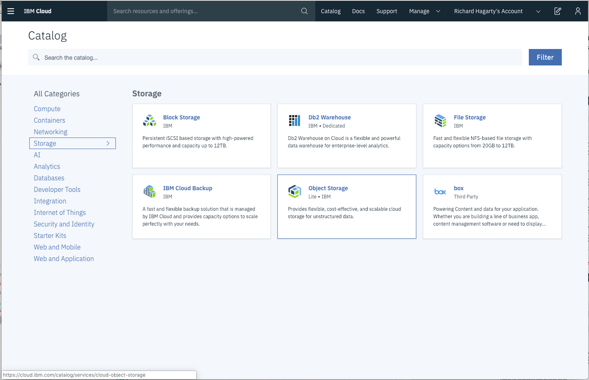

* Enter a service name, select the `Lite` plan, then press `Create`.

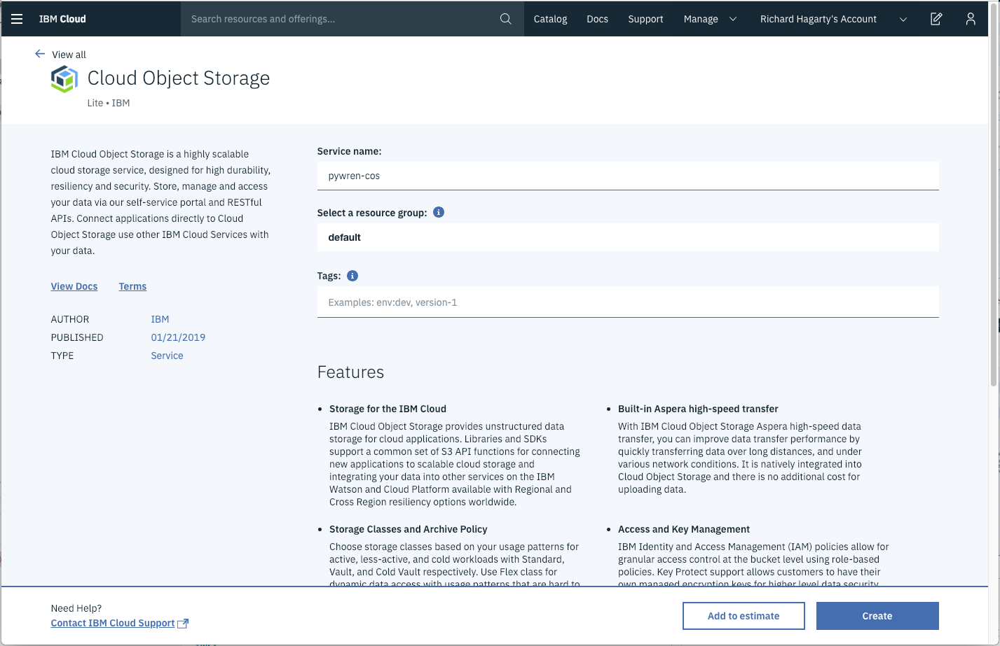

Once you have your COS instance created, you will need to perform these additional steps:

* Create HMAC credentials
* Create a storage bucket

### 1a. Create HMAC credentials for the Cloud Object Storage instance

Create a `Keyed-Hashing for Message Authentication` (HMAC) set of credentials for your Cloud Object Storage (COS) instance.

* From your COS instance panel, click the `Service credentials` tab.

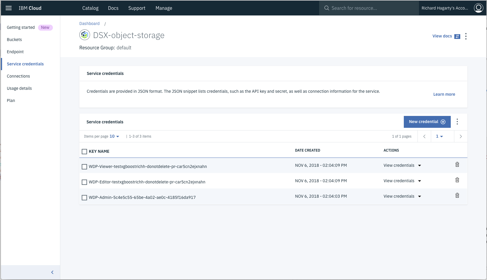

* Click on `New Credential` to initiate creating a new set of credentials. Enter a name, then enter `{"HMAC":true}` in the `Add Inline Configuration Parameters` field. Press `Add` to create the credentials.

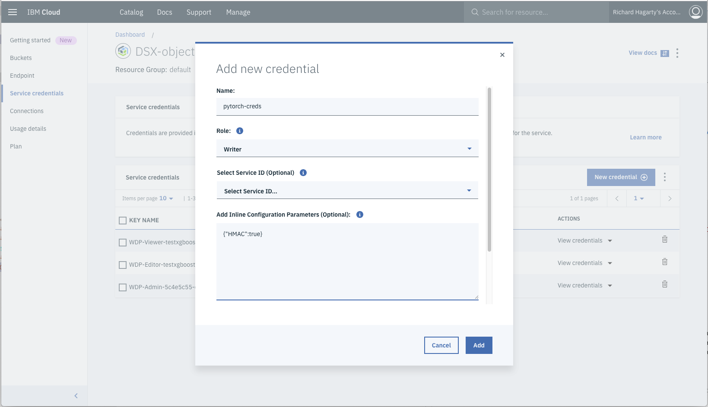

* Once the credentials are created, you should see a set of `cos_hmac_keys` values.

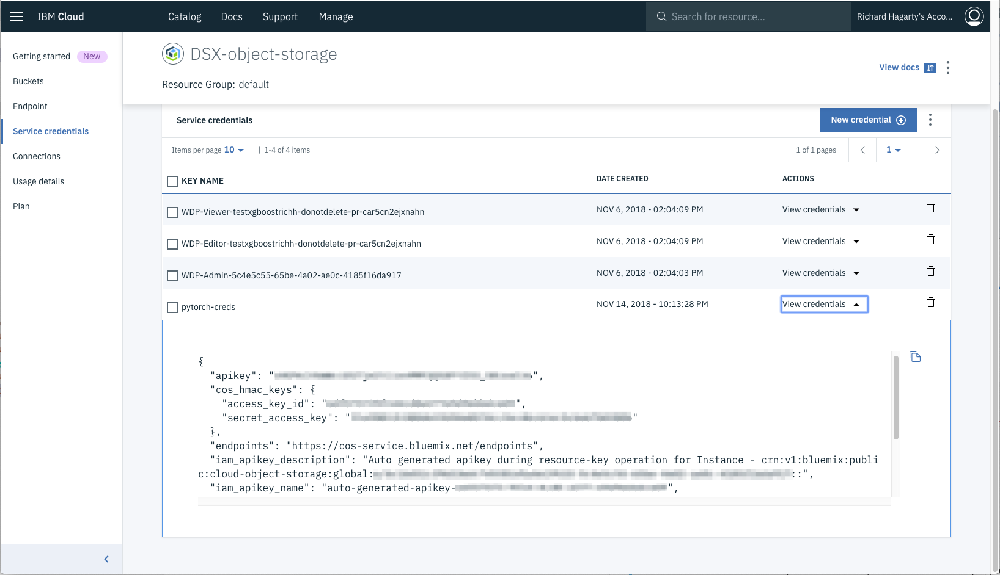

### 1b. Create an IBM Cloud Object Storage bucket

Create a Cloud Object Storage (COS) bucket to store input data used by the notebook.

* From your COS instance panel, click the `Buckets` tab.

You can choose to use an existing bucket, or create a new one.

Once you have determined which bucket to use, you will also need to determine the endpoint for the region associated with the bucket.

To determine the region endpoint, note the `Resiliency` and `Location` of the selected bucket. Then click on the `Endpoint` tab. From there, select the appropriate values from the `Select resiliency` and `Select location` drop-down list. You will then be presented a list of the matching endpoint URLs.

Once completed, take note of the following values assoicated with your Cloud Object Storage instance. You will need to enter them when creating and executing the notebook in Watson Studio:

* instance name
* HMAC credentials
* bucket name and endpoint URL

## 2. Create a Watson Machine Learning Service instance

If you do not already have a running instance of the Watson Machine Learning (WML) service, follow these steps to create one.

* From the IBM Cloud Catalog, under the AI category, select [Machine Learning](https://cloud.ibm.com/catalog/services/machine-learning).


* Enter a service name, select the `Lite` plan, then press `Create`.

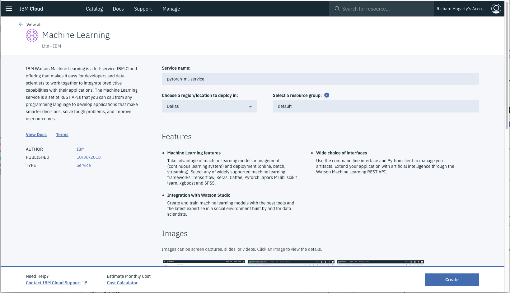

* Once the service instance is created, navigate to `Service credentials`, view credentials and make note of them. If you don't see any credentials available, create a `New credential`.

  <!-- PLEASE! Make this workaround go away. Delete it when fixed. -->
  > If you get this error: *"You do not have the required permission to assign role 'Writer'. Contact the account owner to update your access."* Give yourself writer access by:
  * Use the IBM Cloud menu `☰` and select `Security`.
  * Click on `Manage`.
  * Click on `Identity and Access`.
  * Use the three dots icon to assign access to yourself.
  * Click on `Assign access to resources`.
  * Use the `Services` pulldown to select `All Identity and Access enabled services`.
  * Use the checkbox to enable `Writer`.
  * Hit `Assign`.
  * Go back and try to create your Watson ML credentials again.


Once completed, take note of the WML credentials, as you will need to enter them when executing the notebook in Watson Studio:

## 3. Create an IBM Cloud Functions service

* From the IBM Cloud Catalog, under the AI category, select [Functions](https://cloud.ibm.com/openwhisk/learn/concepts).

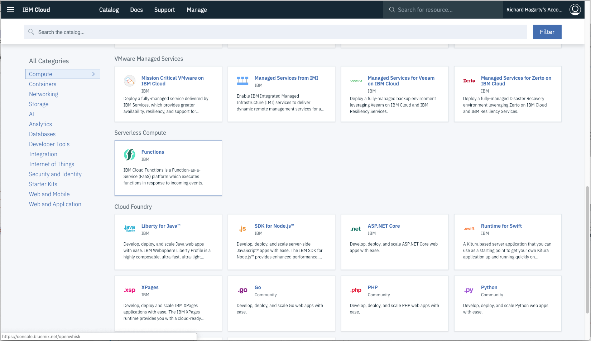

Navigate to the `API Key` tab to determine the values you will need to enter into your notebook.

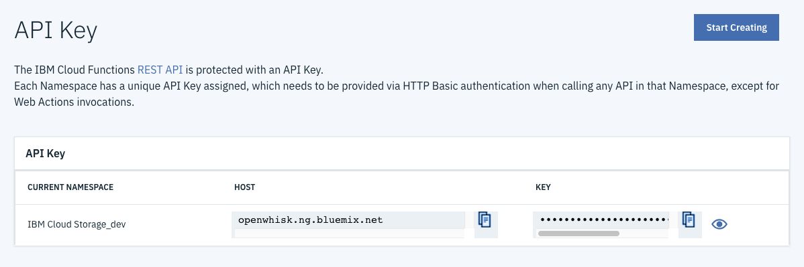

* In the notebook available with this pattern, there is a cell which requires you to enter your Cloud Functions access data. Copy and paste these values into that notebook cell.

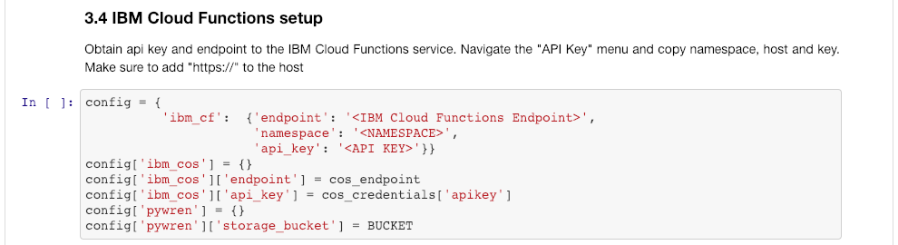

Once completed, take note of the namespace, host, and key values, as you will need to enter them when executing the notebook in Watson Studio:

## 4. Create a Watson Studio project

From the Watson Studio home page, select `New Project`, then select the `Create Project` button located in the `Data Science` tile.


* On the creation panel, enter a unique project name. For `Select storage service`, select the Cloud Object Storage instance that your created in ***Step #1***.


* Upon a successful project creation, you are taken to a dashboard view of your project. Take note of the `Assets` and `Settings` tabs, we'll be using them to associate our project with any external assets (such as notebooks) and any IBM Cloud services.


## 5. Create a custom runtime environment

From the project dashboard view, select the `Environments` tab, and click on `New environment definition`.

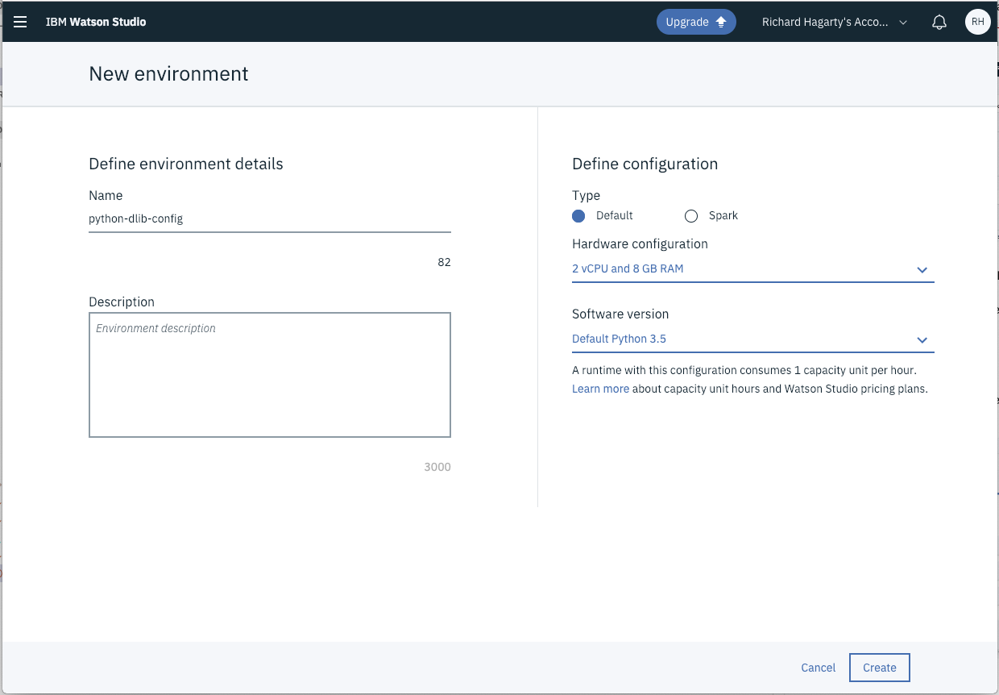

Provide a unique name for your enviroment, keep the default configuration options, then press `Create`.

> Note: Ensure that the `Software Version` is set to `Python 3.5`

From the environment summary panel, locate the `Customization` area on the bottom right-side of the panel. Press `Create` to enter customization options.

Add ***dlib*** and ***conda-forge*** to the customization list in the format shown below:

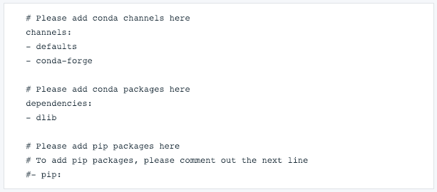

Press `Apply` to save your changes.

## 6. Create the notebook

From the project dashboard view, select the `Add to project` drop-down menu and click on `Notebook`.


Use the `From URL` tab to create our notebook.


* Give your notebook a name and select your desired runtime. In this case, select the runtime environment that you created in the previous step.

* For URL, enter the following URL for the notebook stored in our GitHub repository:

  ```bash
  https://raw.githubusercontent.com/IBM/data-pre-processing-with-pywren/master/notebooks/facial-recognition.ipynb
  ```

* Press the `Create Notebook` button. This will initiate the loading and running of the notebook within Watson Studio.

## 7. Run the notebook

To view your notebooks, select `Notebooks` in the project `Assets` list. To run a notebook, simply click on the `Edit` icon listed in the row associated with the notebook in the `Notebooks` list.


Once the notebook is loaded and running, you will see several cells where additional data is required. The data will come from the setup of the IBM Cloud services that you performed in pervious steps.

* In this cell, add your Cloud Object Storage instance credentials:


* In this cell, add your Cloud Object Storage bucket name and endpoint URL:

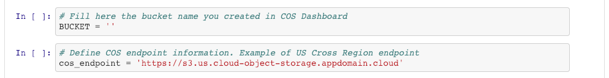

* In this cell, add your Watson Machine Learning credentials:

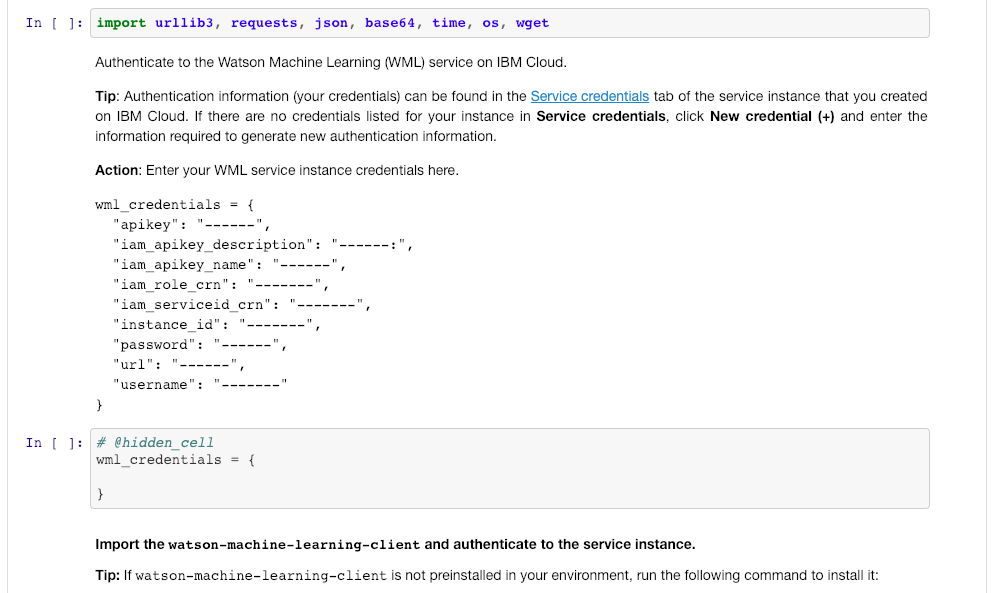

* In this cell, add the data from your IBM Cloud Functions service:


Note: the endpoint value should combine `https://` with the `HOST` name listed in the `API Key` data. For example, `https://openwhisk.ng.bluemix.net`.

Some background on executing notebooks:

> When a notebook is executed, what is actually happening is that each code cell in
the notebook is executed, in order, from top to bottom.
>
> Each code cell is selectable and is preceded by a tag in the left margin. The tag
format is `In [x]:`. Depending on the state of the notebook, the `x` can be:
>
>* A blank, this indicates that the cell has never been executed.
>* A number, this number represents the relative order this code step was executed.
>* A `*`, which indicates that the cell is currently executing.
>
>There are several ways to execute the code cells in your notebook:
>
>* One cell at a time.
>   * Select the cell, and then press the `Play` button in the toolbar.
>* Batch mode, in sequential order.
>   * From the `Cell` menu bar, there are several options available. For example, you
    can `Run All` cells in your notebook, or you can `Run All Below`, that will
    start executing from the first cell under the currently selected cell, and then
    continue executing all cells that follow.
>* At a scheduled time.
>   * Press the `Schedule` button located in the top right section of your notebook
    panel. Here you can schedule your notebook to be executed once at some future
    time, or repeatedly at your specified interval.

# Sample output

# Links

* [Create Watson Studio Notebooks](https://dataplatform.cloud.ibm.com/docs/content/analyze-data/creating-notebooks.html)

# Learn more

* **Data Analytics Code Patterns**: Enjoyed this Code Pattern? Check out our other [Data Analytics Code Patterns](https://developer.ibm.com/technologies/data-science/)
* **AI and Data Code Pattern Playlist**: Bookmark our [playlist](https://www.youtube.com/playlist?list=PLzUbsvIyrNfknNewObx5N7uGZ5FKH0Fde) with all of our Code Pattern videos
* **Watson Studio**: Master the art of data science with IBM's [Watson Studio](https://www.ibm.com/cloud/watson-studio)
* **Spark on IBM Cloud**: Need a Spark cluster? Create up to 30 Spark executors on IBM Cloud with our [Spark service](https://cloud.ibm.com/catalog/services/apache-spark)

# License

This code pattern is licensed under the Apache License, Version 2. Separate third-party code objects invoked within this code pattern are licensed by their respective providers pursuant to their own separate licenses. Contributions are subject to the [Developer Certificate of Origin, Version 1.1](https://developercertificate.org/) and the [Apache License, Version 2](https://www.apache.org/licenses/LICENSE-2.0.txt).

[Apache License FAQ](https://www.apache.org/foundation/license-faq.html#WhatDoesItMEAN)
